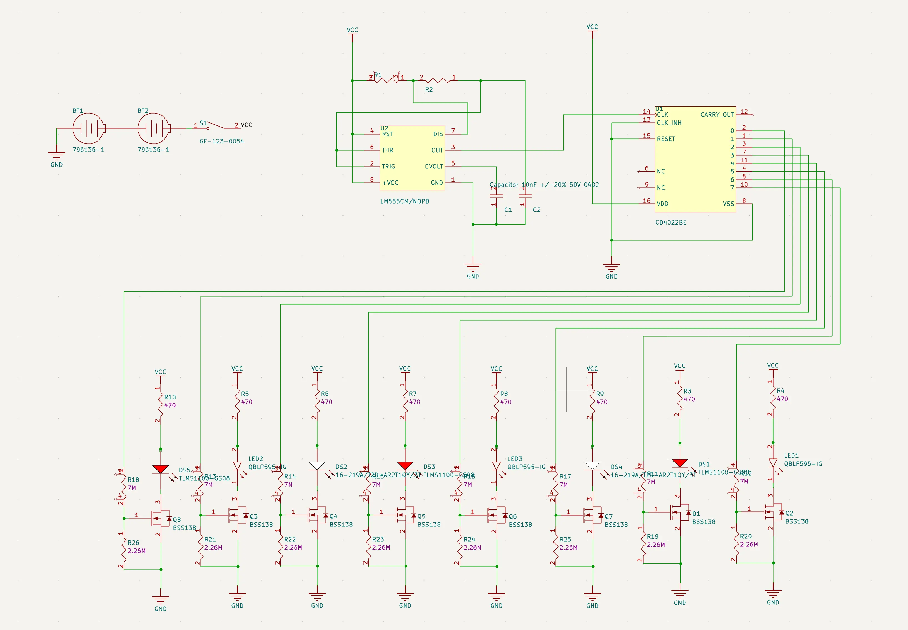
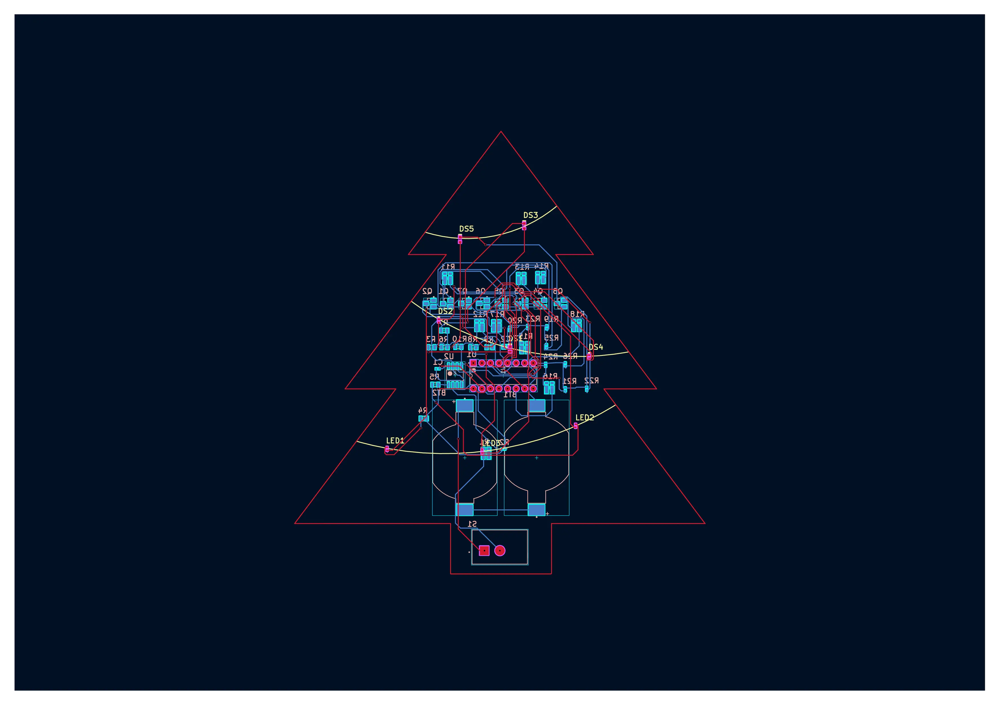
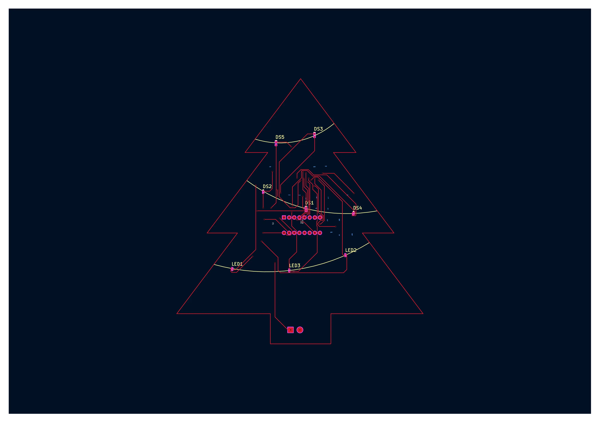
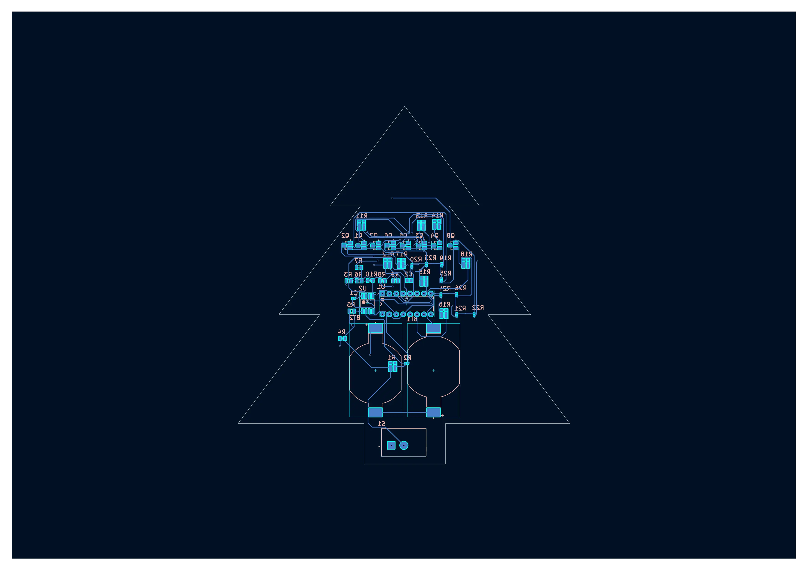
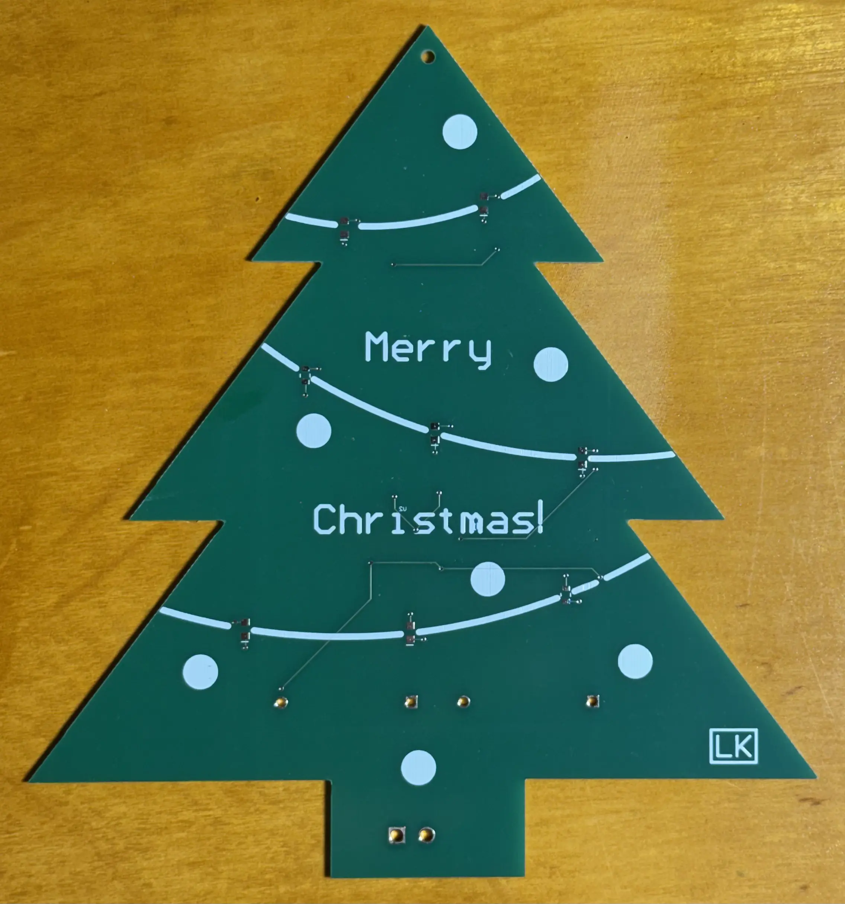
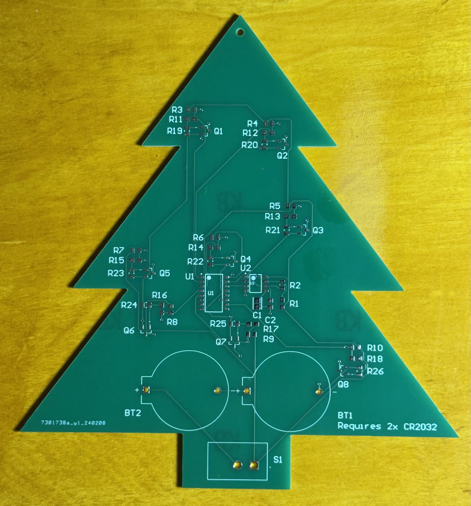
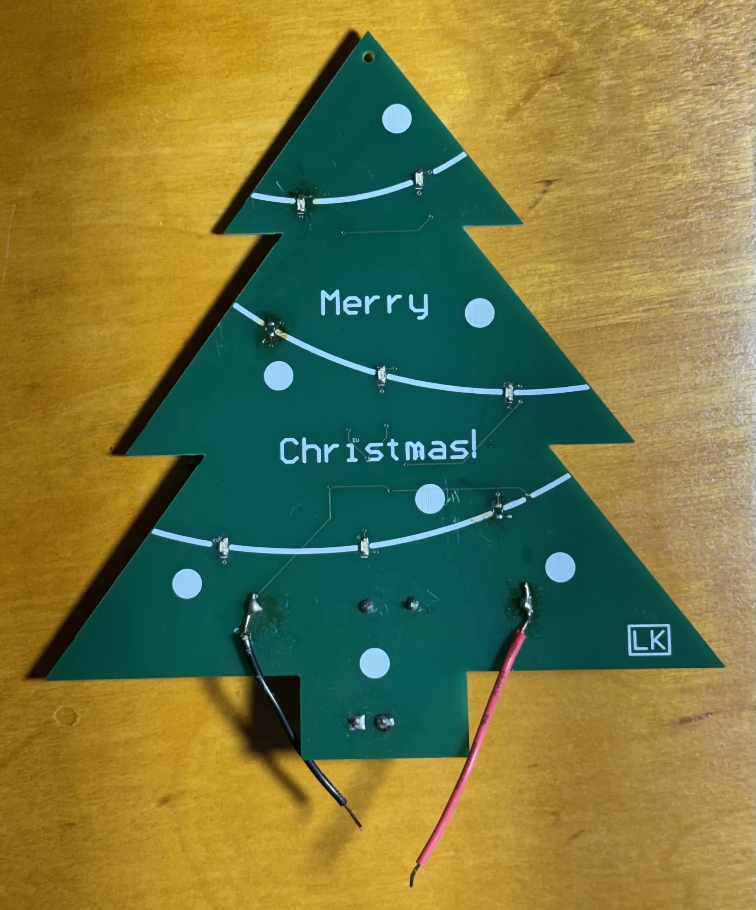
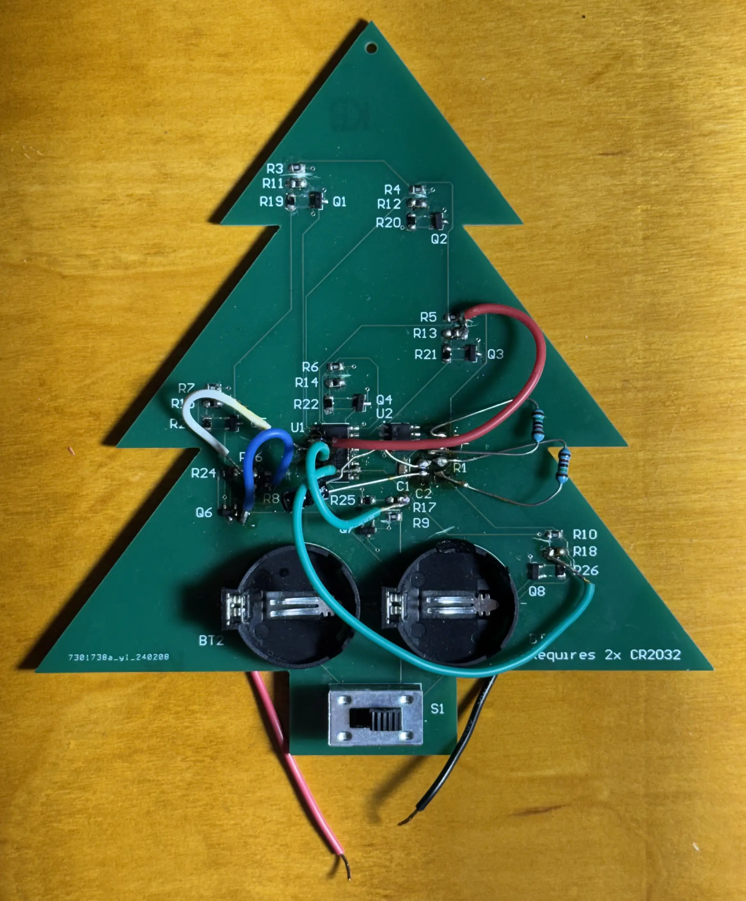

# christmas-trees

Simple light-up Christmas tree ornaments.

This was a practice project for learning Altium Designer and practicing PCB design, board bring-up, and debugging.

## Design

The double-sided board uses the front silkscreen layer to make the LEDs appear like a strand of lights on a Christmas tree. When two CR2032 coin cell batteries are inserted on the back and the switch is turned on, the lights flash sequentially.

The design uses a simple LM555 timer circuit to increment an octal counter. Each output of the counter controls a single LED.

## Files

```
.
├── altium       original Altium Designer files
├── kicad        converted KiCad files
├── images       schematic, board view, and PCB images
└── README.md
```

## Project Images

### Schematic
<details>
<summary>Click to expand</summary>

</details>

### Board Views
<details>
<summary>Click to expand</summary>



</details>

### Bare Board

Bare board fresh from JLCPCB. They came back looking clean.

<details>
<summary>Click to expand</summary>


</details>

### Modded Board

Of course the first run had some bugs. I was able to get it working after a bit of troubleshooting and some board modifications.

<details>
<summary>Click to expand</summary>


</details>

## Lessons Learned

- Double check trace widths before ordering. I used the default trace width, which led to the traces being thinner than expected. It didn't cause any electrical issues, but the traces could've been wider for the same cost.

## Next Steps

- Translate indentified design issues back into schematic and layout
- Order another run of boards
